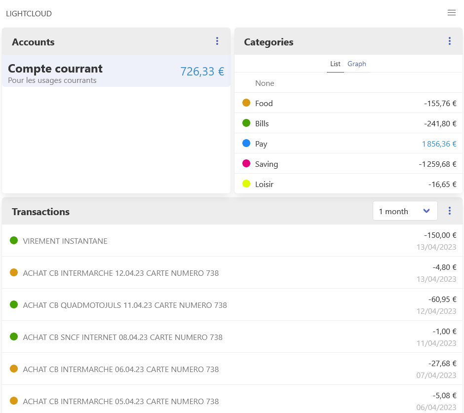

# Description



Test of a full working app using a modern (in early 2023 !), flexible, light and fast tech stack. The objective is to have a nice balance between functionnalities and ease of setup. The API should be separated from the front since the app should be open to a mobile app, the tech stack should allow this without to much configuration.

The result is :
- Frontend :
    - [SvelteKit v1.0](https://kit.svelte.dev/) to create a SPA
    - [Bulma](https://bulma.io/) for the style
- Backend :
    - [Fastify](https://www.fastify.io/) to create an API
    - [Prisma](https://www.prisma.io/) for database ORM
    - [Mongodb](https://www.mongodb.com) for the database system
- [Nginx](https://www.nginx.com/) for reverse proxy
- [Docker](https://www.docker.com/) for hosting

Some other techs I tested :
- [Express](https://expressjs.com/) with [Vue.js](https://vuejs.org/) with a very simple tech stack
- [Nuxt.js v3](https://nuxt.com/) to have more alternatives (including SSR), the framework just came out and is missing some exemples and doc about edge case uses
- [Primer.css](https://primer.style/css/) for a nice styling from github, it's a little bit heavy for a small application though (even with PurgeCSS and other optimisation)


# Getting started

## Docker

Start :
```
docker-compose up
```

Build (after Dockerfile modif) :
```
docker-compose build
```

Clean docker :
```
docker-compose down -v --rmi all --remove-orphans
```

Execute a cmd in a container :
```
docker-compose exec [nom-container] /bin/bash
```

### Silence
Start with :
```
docker-compose up -d
```

Or simply only show the log of one container :
```
docker-compose logs api -f
```

## Database

### Setup a replica mongodb database

#### Windows

Tutorial : https://adelachao.medium.com/create-a-mongodb-replica-set-in-windows-edeab1c85894

#### Linux

Open the `mongosh` cmd on the db server :
```
docker-compose exec db /bin/sh
mongosh
```
Use this setup :
```js
rs.initiate()
```

### Prisma ORM
Push schema to database : 
```
npx prisma db push
```

Start prisma studio (interface to DB) :
```
npx prisma studio
```

### Default user

`test` password hashed :
```
$2b$10$DCmF8dlyil4vK5CUSzUgeO5Uoip1DRvTFaGeUXHgxElikdGbqguwu
```